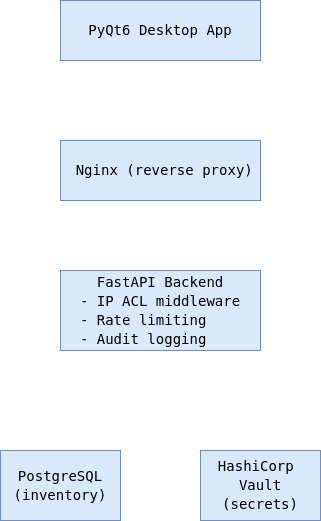
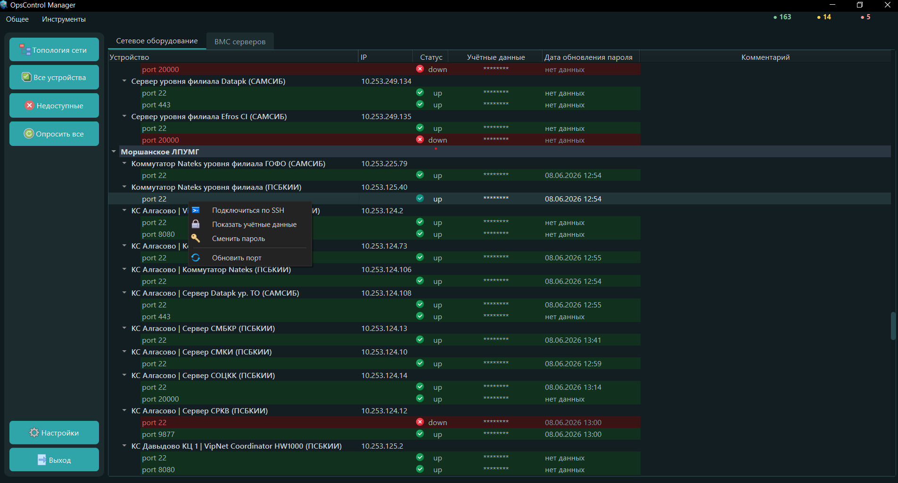

# OpsControl

**OpsControl** - система централизованного управления инфраструктурными учётными данными с автоматической ротацией паролей.

Проект написан под реальные задачи: в инфраструктуре с десятками серверов и сетевых устройств пароли часто хранятся в таблицах, в головах или нигде - OpsControl решает эту проблему. Все учётные данные хранятся в HashiCorp Vault, доступ к ним логируется, а смена паролей запускается по SSH напрямую с устройства.

---

## Содержание

- [Стек технологий](#стек-технологий)
- [Архитектура](#архитектура)
- [Интерфейс](#интерфейс)
- [Функциональность](#функциональность)
- [Безопасность инфраструктуры](#безопасность-инфраструктуры)
- [Инфраструктура и деплой](#инфраструктура-и-деплой)
- [CI/CD](#cicd)
- [Запуск](#запуск)
- [Тестирование](#тестирование)
- [Мотивация](#мотивация)
- [Roadmap](#roadmap)


## Стек технологий

| Слой | Технологии |
|---|---|
| Backend | Python 3, FastAPI, Uvicorn, Pydantic v2 |
| База данных | PostgreSQL 15/16, psycopg2, connection pool |
| Secrets | HashiCorp Vault 1.15 (KV v2, AppRole, dynamic DB creds) |
| Frontend | Python, PyQt6 (десктопное приложение) |
| Инфраструктура | Docker, Docker Compose, Nginx (reverse proxy) |
| CI/CD | GitLab CI (6 стадий: prepare → test → build → verify → report → deploy) |
| Тесты | pytest, pytest-asyncio, pytest-cov, unit + integration + e2e |
| Качество кода | Ruff, Black, Mypy |

---

## Архитектура



**Иерархия инфраструктуры:** Филиалы → Серверы → Порты/Сервисы → Учётные данные

---

## Интерфейс

### Главное окно




## Функциональность

### Управление инфраструктурой
- Иерархический каталог: филиалы → серверы → порты
- Поддержка устройств: Linux, Windows, Cisco, Nateks, xClarity
- Проверка доступности портов в реальном времени (multi-threaded)

### Ротация паролей
- Автоматическая смена паролей по SSH на Linux (chpasswd), Cisco, Nateks
- Пакетная ротация по нескольким серверам одновременно
- Генератор паролей с настраиваемой политикой
- Запись результата каждой ротации (успех/ошибка, временная метка)

### Управление учётными данными
- Хранение секретов в Vault (KV v2)
- Просмотр с подтверждением мастер-паролем
- Массовый импорт и экспорт (CSV/JSON)
- Десктопный клиент: дерево инфраструктуры, запуск SSH/RDP-сессий, пакетные операции

Backend реализует REST API для управления инфраструктурой и секретами, фронтенд общается с ним через HTTP.

---

## Безопасность инфраструктуры

Безопасность строится на нескольких независимых уровнях:

**HashiCorp Vault**
- Бэкенд аутентифицируется через AppRole (role_id + secret_id), токен автоматически обновляется фоновым процессом
- Пользователи аутентифицируются через Vault Userpass - никаких паролей в БД
- Учётные данные PostgreSQL выдаются Vault динамически с TTL - статических паролей к БД не существует

**Сеть и доступ**
- IP-based ACL: настраиваемый список разрешённых подсетей на уровне middleware
- Nginx передаёт реальный IP через X-Real-IP, список доверенных прокси фиксирован в конфиге
- Rate limiting: настраиваемое количество попыток входа, блокировка на заданное время

**Аудит**
- Каждый запрос к секретам пишется в audit.log: пользователь, IP, действие, сервер, результат, время, request ID
- Логи хранятся в отдельном Docker volume

---

## Инфраструктура и деплой

Проект рассчитан на эксплуатацию в изолированных сетях без прямого доступа в интернет.

**Окружения**
- `docker-compose.yml` - локальная разработка
- `docker-compose-staging.yml` - staging с фиксированной подсетью (172.23.0.0/16), отдельными портами и Nginx
- Production деплоится вручную через GitLab CI после прохождения всех тестов

**Образы**
- Production-образ собирается в CI и пушится во внутренний registry (localhost:5050)
- Для переноса в изолированную среду: `docker save` / `docker load`

**Инициализация**
- Схема БД накатывается из `scripts/init.sql` при первом старте
- Vault инициализируется скриптом `scripts/vault-init.sh` (unseal, настройка AppRole, KV engine, database engine, политики)
- Для разработки - `vault-init-dev.sh` с упрощёнными настройками

**Данные**
- `pg_data`, `vault_data`, `backend_logs` - именованные Docker volumes, переживают пересборку контейнеров

---

## CI/CD

| Стадия | Что происходит |
|---|---|
| `prepare` | Сборка CI-образа с зависимостями |
| `test` | Линтинг (ruff, black, mypy) + юнит-тесты + coverage |
| `build` | Сборка production Docker-образа, пуш в registry |
| `verify` | Pipeline автоматически поднимает временные контейнеры Postgres и Vault, прогоняет интеграционные и e2e тесты, после прохождения уничтожает их |
| `report` | Объединение coverage-отчётов (unit + integration), Cobertura + JUnit XML |
| `deploy` | Ручной триггер: ветка dev → staging, ветка main → production |

---

## Запуск

Для локальной разработки используется Docker Compose и упрощённая конфигурация HashiCorp Vault.

```bash
git clone https://github.com/Baton4ik48/OpsControl.git
cd OpsControl

docker compose up -d
```
После запуска необходимо инициализировать Vault и базу данных.

Дополнительная инициализация Vault и базы данных выполняется скриптами из каталога `scripts/`.

Production и staging окружения разворачиваются через GitLab CI/CD и используют предварительно подготовленную инфраструктуру (Vault, PostgreSQL, внутренний Docker Registry).

## Тестирование

```bash
pytest tests/unit/ -v --cov=app
pytest tests/integ/ -v
pytest tests/e2e/ -v -m e2e
```

## Мотивация

В инфраструктуре с сотнями серверов и сетевых устройств становится сложно контролировать состояние сервисов, управлять учётными данными и отслеживать доступ к ним. Пароли часто хранятся в таблицах, документах или передаются между администраторами вручную, что создаёт риски для безопасности и усложняет сопровождение.

OpsControl создаётся как единая точка управления инфраструктурой, учётными данными и базовым мониторингом доступности сервисов.

Основные задачи проекта:

* централизованное хранение секретов в HashiCorp Vault;
* контроль доступа и аудит операций с учётными данными;
* автоматизация ротации паролей на серверах и сетевых устройствах;
* раннее выявление недоступности сервисов и проблем в инфраструктуре;
* упрощение SSH-workflow без хранения паролей в таблицах и документах;
* защита от несанкционированного доступа и брутфорс-атак;
* повышение прозрачности: кто, когда и к каким данным обращался.

Цель проекта - сократить количество ручных операций, повысить безопасность инфраструктуры и быстрее выявлять проблемы до того, как они повлияют на работу инфраструктуры.

---

## Roadmap

### Реализовано

- [x] HashiCorp Vault
- [x] Dynamic PostgreSQL Credentials (Vault)
- [x] Password Rotation
- [x] Audit Logging
- [x] Docker Compose
- [x] GitLab CI/CD
- [x] Integration и E2E тестирование

### В разработке

- [ ] Интеграция с Zabbix API
- [ ] Расширение поддержки сетевого оборудования при смене паролей
- [ ] Дополнительные механизмы отчётности
- [ ] Улучшение мониторинга сервисов

---

## Автор

**Андрей Отроков** - DevOps-инженер

[Email](mailto:hello@opscontrol.dev) · [Telegram](https://t.me/Swed48) · [GitHub](https://github.com/Baton4ik48/OpsControl)
